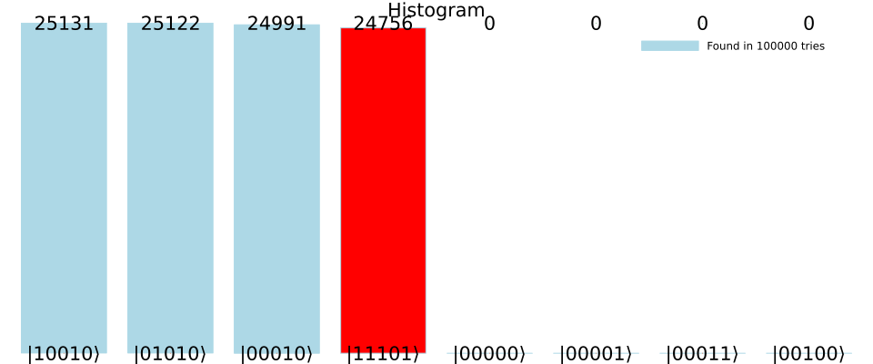
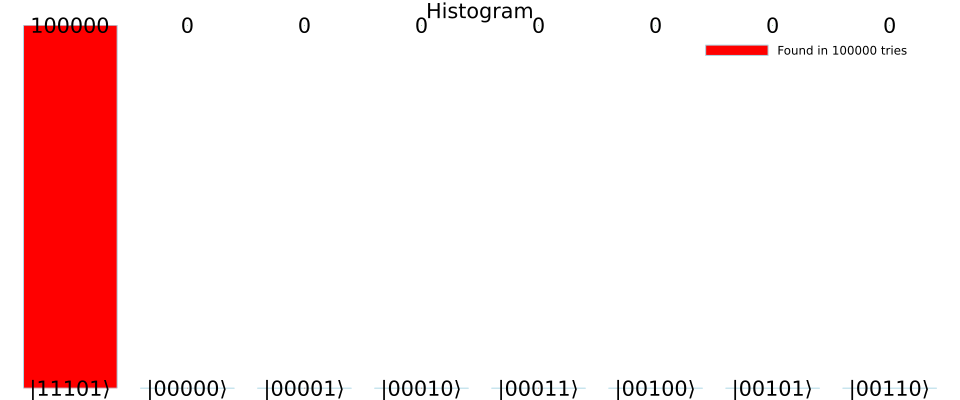

# An easy to use module for Quantum Machine Learning

## Introduction
This module written in Julia uses the Yao.jl framework and automates the creation of quantum circuits
specifically tailored for QML training using amplitude amplification.
It is a Proof-of-Concept implementation in the setting where portions of a circuit are parameterized using dedicated parameter qubits. These parameter qubits are then tuned using amplitude amplification according to a cost function.

For example, consider the simple case where we want to learn a quantum circuit that generates
samples from the [Bernoulli distribution](https://en.wikipedia.org/wiki/Bernoulli_distribution) with $p=\frac{3}{4}$. Given the observations $1,0,1,1$, we construct the following quantum circuit:


In this setting, the amplitude of the parameter qubits are to be amplified, when the target qubit is 1.
Measuring the parameter qubits then yields a quantum circuit model for the Bernoulli distribution, which we aim to learn.

## Installation

### Prerequisites
- Julia programming environment

### Setting Up the Module
1. Clone the repository or download the module files to your local machine.
2. Ensure that Julia and all necessary packages are installed.

## Usage

### Basic Setup and Module import

#### Static import

To be able to use static imports with this module, you need to add the following packages to your Julia environment:

- `GR`
- `Yao`
- `YaoPlots`
- `Plots`
- `BitBasis`
- `StatsBase`

Then, you can include the following header:

```julia
if !isdefined(Main, :QML)
    include("../Modules/QML.jl")
    using .QML
end

using Yao
using Yao.EasyBuild, YaoPlots
```

#### Creating a temporary virtual environment

Include this code at the beginning of your script. This will automatically import all necessary modules. Note that these are relative paths and might need to be changed according to your file structure.

```julia
if !isdefined(Main, :QML)
    include("../Modules/SetupTool.jl")

    using .SetupTool
    if setupPackages(false, update_registry = false)
        include("../Modules/QML.jl")
        using .QML
    end
end

using Yao
using Yao.EasyBuild, YaoPlots
```

If you experience any issues with the way modules are imported, you could use the code below as a workaround. However, then you will not be able to see module documentation.

```julia
include("../Modules/SetupTool.jl")
using .SetupTool
setupPackages(false, update_registry = false)
using Revise

Revise.includet("../Modules/QML.jl")
using .QML
using Yao
using Yao.EasyBuild, YaoPlots
```

### Model and parameter lanes

In our module, we divide the circuit into two main components, the `parameter lanes` and the `model lanes`. This division should help organize the circuit. The `model lanes` are all lanes controlled by the model parameters. The `parameter lanes` represent the parameters of the model. When using the module, you should always know what your model lanes and parameter lanes are. The module will automatically adapt the circuit to your learning problem.

### Creating a circuit

Circuit creation is mainly done using `Yao`. There are legacy functions that can be used to create circuits, but we recommend using the `Yao` functions directly. For more information on how to use our legacy functions, please refer to the [legacy documentation](readme_legacy.md). Note that this documentation is no longer maintained.

### Generating a QML circuit

You can convert your circuit into a QML circuit using a `QMLBlock`. This block requires you to provide a circuit, the indices of the model lanes, parameter lanes, and the training data. There are several options how to provide the training data. Let's take a look at a basic example:

Assume we want to train a model to learn the `X` gate. Let us define a model with one model lane and two parameter lanes. In our model, we want an `X` gate to be applied, iff both parameters are in the state `|1>`.

```julia
# Initialize a circuit with 1 model and 2 parameter lane
circuit = chain(3, repeat(H, (2, 3)), control(2:3, 1 => X))

model_lanes = 1
param_lanes = 2:3
```

Now, let's train the model on the tuple `(false, true)`, meaning that we want to map the `|0>` state to `|1>`. For that, let us prepare the training data. Note that we are supposed to provide a batch of features. In this case, we only have one feature.

```julia
# We want to fit the model on this tuple
training_tuple = (false, true)

# The sample size must match the number of model lanes (number of features)
sample = [training_tuple]

# We define a batch of our single sample
batch = [sample]
```

Note that if the training data only consist of tuples `(false, ?)`, we can do not have to provide the entire tuple, but can provide a single boolean value instead. So the following code would be equivalent:

```julia
# The size of the sample must match the number of model lanes (number of features)
sample = [true]

# We define a batch of our single sample
batch = [sample]
```

Now, we can create a `QMLBlock`, which will automatically determine the optimal number of Grover iterations and apply them to the circuit. If we then measure the quantum register, we should extract the correct state `|111>`.

```julia
qml = QMLBlock(circuit, model_lanes, param_lanes, batch; log=true)
```

Let's make the example a bit more complex by fitting the model on two training samples. As we want to learn the `X` gate, we could additionally provide the tuple `(true, false)`. This will not change anything in the learned parameters, but it will demonstrate how to provide multiple training tuples. Again, let's prepare the training data and create the QML model.

```julia
# We want to fit the model on those two tuples
training_tuple_1 = (false, true)
training_tuple_2 = (true, false)

# The sample size must match the number of model lanes (number of features)
sample_1 = [training_tuple_1]
sample_2 = [training_tuple_2]
batch = [sample_1, sample_2]

grover = QMLBlock(circuit, model_lanes, param_lanes, batch; log=true)
```

Note that if we create a `QMLBlock` without providing the number of Grover iterations, the module will simulate the circuit to determine the optimal number of Grover iterations. For larger circuits, this can be time-consuming. If you know the optimal number of Grover iterations, you can provide it as an argument. For instance, if you know that the optimal number of Grover iterations is `1`, you can create the `QMLBlock` as follows:

```julia
grover = QMLBlock(circuit, model_lanes, param_lanes, batch; log=true, grover_iterations=1)
```

### Specifying hidden model lanes

Sometimes, it is desirable to have model lanes that do not directly contribute to the output. For instance, we can have some internal states like hidden layers in a neural network. We can specify that a model lane should not be fitted by providing `nothing` as the desired output. Let's say we have a model with two model lanes and two parameter lanes. We want to fit the model on the tuple `(false, true)`, but we do not care about the second model lane. We can do that as follows:

```julia
# Initialize a circuit with 2 model and 2 parameter lanes
circuit = chain(4, repeat(H, (3, 4)), control(3:4, 1 => X), control(3, 2 => Ry(π/2)))

# Specify the model and parameter lanes
model_lanes = 1:2
param_lanes = 3:4

# We want to fit the model on this tuple
training_tuple_lane_1 = (false, true)
# We do not care what we get on the second lane
training_tuple_lane_2 = (false, nothing)

# The sample size must match the number of model lanes (number of features)
sample = [training_tuple_lane_1, training_tuple_lane_2]

# We define a batch of our single sample
batch = [sample]

grover = QMLBlock(circuit, model_lanes, param_lanes, batch; log=true)
```

### Visualizing a circuit

You can visualize a circuit using the function `vizcircuit`.

```julia
vizcircuit(grover)
```

If you want to visualize the built main circuit (without the amplitude amplification), you can create a `QMLBlock` with specifying `0` grover iterations. You can then see the modifications that are made by the QML block to convert it into a learning circuit with the specified training data.

```julia
grover = QMLBlock(circuit, model_lanes, param_lanes, batch; grover_iterations=0)

vizcircuit(grover)
```

### Visualizing measurements

You can visualize the measurements of a circuit using the function `plotmeasure`. This function takes any number of measurements and plots them in a bar chart.

```julia
plotmeasure(measurements)
```

For example, let's measure a the circuit from the previous example.

```julia
# Initialize a circuit with 1 model and 2 parameter lane
my_circuit = chain(3, repeat(H, (2, 3)), control(2:3, 1 => X))

model_lanes = 1
param_lanes = 2:3
```

Now, we visualize the circuit:

```julia
vizcircuit(my_circuit)
```


And we visualize the measurements:

```julia
measurements = zero_state(3) |> my_circuit |> r->measure(r; nshots=1000)
plotmeasure(measurements)
```


To be able to validate the model, we can also highlight the desired in another color. The most comfortable way to do this is to directly provide the `QMLBlock`. As the `QMLBlock` knows the desired state, the function will automatically highlight the desired states. Let's visualize the distribution without training the model:

```julia
qml = QMLBlock(my_circuit, model_lanes, param_lanes, batch; log=true, grover_iterations=0)
plotmeasure(qml; sort=true, num_entries=8)
```



Now, let's visualize the results after training the model:

```julia
qml = QMLBlock(my_circuit, model_lanes, param_lanes, batch; log=true)
plotmeasure(qml; sort=true, num_entries=8)
```



Keep in mind that the last bit is our model lane, while the first two bits are our parameter lanes.

If you want to create more specialized visualizations, we provided some optional arguments. For instance, we can provide an oracle_function to highlight the desired output states. Let's say we want to highlight the first three bars:

```julia
plotmeasure(measurements; oracle_function=i -> i==1||i==5)
```


Keep in mind that the first quantum state `|000>` is represented by the index `1` (and not `0`).
We can also sort the plot regarding the most appearing states:

```julia
plotmeasure(measurements; oracle_function=i -> i==1||i==5, sort=true)
```


We can also limit the number of entries that are displayed. This setting usually makes sense when plotting a sorted histogram to get the `n` top quantum states.

```julia
plotmeasure(measurements; oracle_function=i -> i==1||i==5, sort=true, num_entries=5)
```

